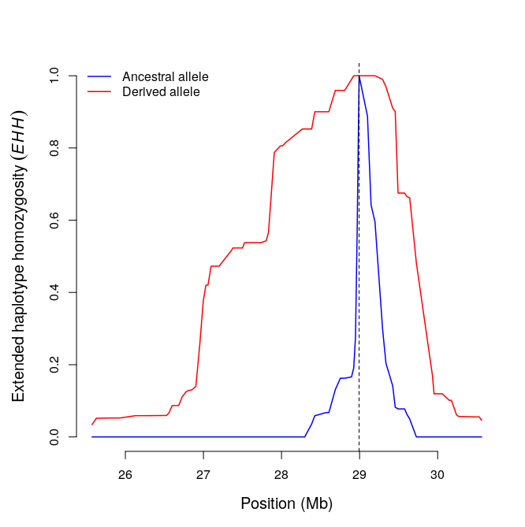
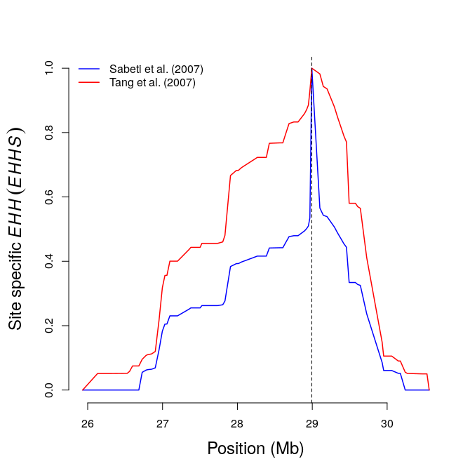
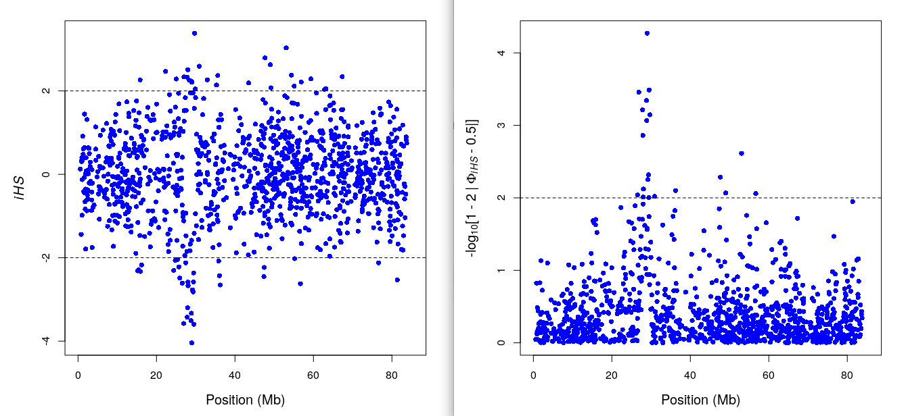
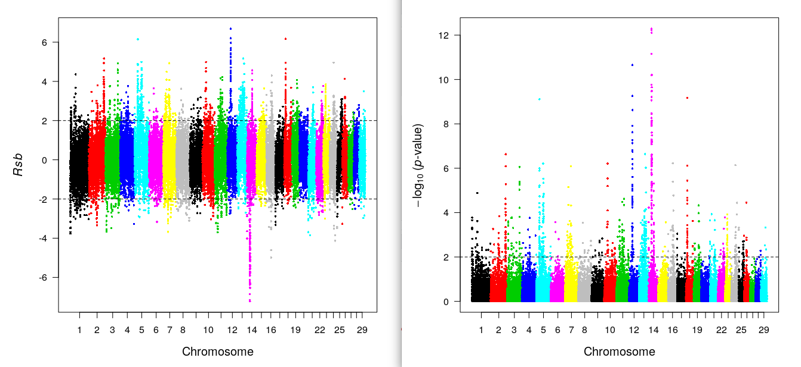
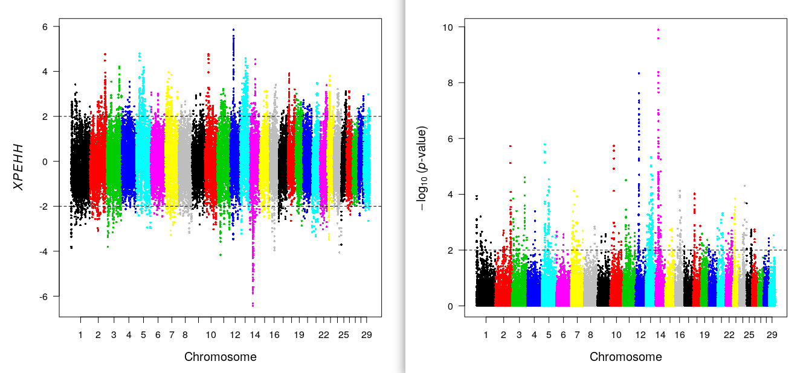

```{r setup, include=FALSE}
knitr::opts_chunk$set(echo = TRUE,cache=T,message = F,warning = F)
```

개념설명은 https://www.slideshare.net/secondmath/fst-selection-index 을 참고하기 바란다. 

## Fst

### Load package & Data Load
```{r}
library(hierfstat);library(data.table);library(knitr);library(DT)
fst.file="https://raw.github.com/jinseob2kim/jinseob2kim/master/fstexample.txt"
a=fread(fst.file)
```

### Read example file. 7 pop & 289 SNPs (PER3 gene)
```{r}
datatable(a)                            
```


### Basic stat: original Fst
```{r}
gg=basic.stats(a)
perloc1=gg$perloc                       # per locus statistics
datatable(perloc1) %>% formatRound(1:ncol(perloc1),3)
```

```{r}
fstloc1=perloc1$Fst                     # per locus Fst
all1=gg$overall                         # overall locus statistics
kable(t(all1),caption = "overall locus statistics",digits = 3)
fst1=all1[7]                            # overall locus Fst
fst1
```

### Weir & Cockerham's theta 
```{r}
gg2=wc(a)
fstloc2=gg2$per.loc$FST                # per locus fst
kable(t(head(fstloc2)),digits=3,caption = "First 6 Fst")
fst2=gg2$FST                           # overall locus: mean
fst2
```

### Compare
```{r}
library(ggplot2)
f=data.table(fstloc1,fstloc2)
ggplot(f,aes(fstloc1,fstloc2))+geom_point()+xlab("Wright's Fst")+ylab("Cockerham's theta")+annotate(geom="text", x=0.02, y=0.4,label= paste("r =",round(cor(fstloc1,fstloc2),3)),size=5)
```


## Selection Index: EHH, iHS, xpEHH

### Read example file, chr=12: 1424 SNPs & 280 haplotype
```{r}
library(rehh)
make.example.files()
datatable(fread("bta12_cgu.hap")[1:100],rownames = F)
datatable(fread("map.inp")[1:100],rownames=F)
b<-data2haplohh(hap_file="bta12_cgu.hap",map_file="map.inp",
recode.allele=TRUE,chr.name=12)
```

### Bifurcation plot
```{r}
bifurcation.diagram(b,mrk_foc=456,all_foc=1,nmrk_l=20,nmrk_r=20,
main="Ancestral Allele")

bifurcation.diagram(b,mrk_foc=456,all_foc=2,nmrk_l=20,nmrk_r=20,
main="Derived Allele")

```

### EHH, Site specific EHH(EHHs)
```{r,eval=T,out.width="100%"}
# computing EHH statistics for the focal SNP at position 456
#par(mfrow=c(1,2))
res1=calc_ehh(b,mrk=456,limhaplo=2,limehh=0.05,plotehh=T)         

res11=calc_ehhs(b,mrk=456,limhaplo=2,limehh=0.05,plotehh=TRUE)   # site EHH

```

### Integrated EHH 
```{r}
res2=scan_hh(b)                  # a: ancestral, d: derived, IES: average of IHHa & IHHd (squared allele freq weighted)
datatable(res2) %>% formatRound(3,2) %>% formatRound(4:7,0)
```

### iHS
```{r,out.width="100%"}
ihs_res2=ihh2ihs(res2)
datatable(ihs_res2$iHS) %>% formatRound(3:4,3)                       ## iHS & pvalue
datatable(ihs_res2$frequency.class) %>% formatRound(2:3,3)           ## summary per alle freq bin.
ihsplot(ihs_res2)                                                    ## iHS plot: y- pvalue, x-bp

```

### Population Comparison: rSB & xpEHH
```{r,out.width="100%"}
data(wgscan.cgu) ; data(wgscan.eut)                 ## Load example result
res.rsb=ies2rsb(wgscan.cgu,wgscan.eut,"CGU","EUT")  ## Rsb: Compare 2 population
kable(head(res.rsb),digits=3)
rsbplot(res.rsb)                                    ## Rsb plot


res.xpehh<-ies2xpehh(wgscan.cgu,wgscan.eut,"CGU","EUT")
kable(head(res.xpehh),digits=3)
xpehhplot(res.xpehh)                                ## xpEHH plot

```

```{r}
plot(res.rsb[,3],res.xpehh[,3],xlab="Rsb",ylab="XPEHH",pch=16,cex=0.5,cex.lab=0.75,cex.axis=0.75)
abline(a=0,b=1,lty=2,main="Rsb vs xpEHH")
```