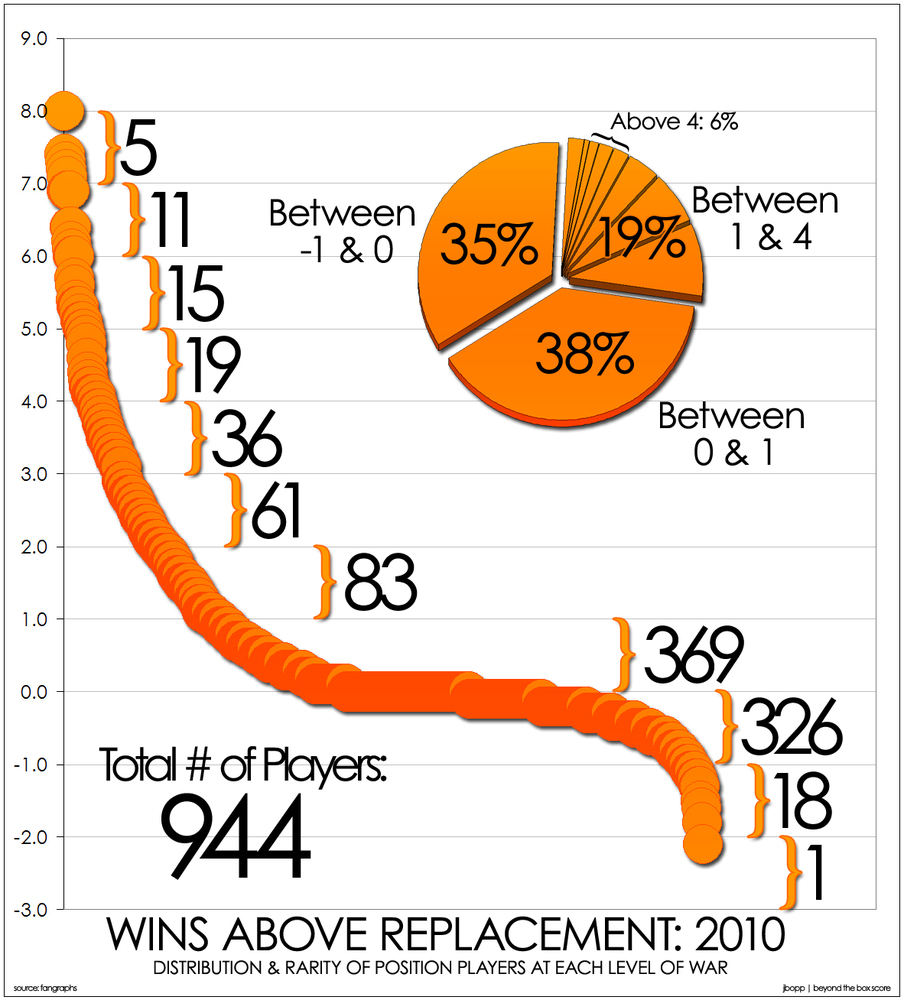
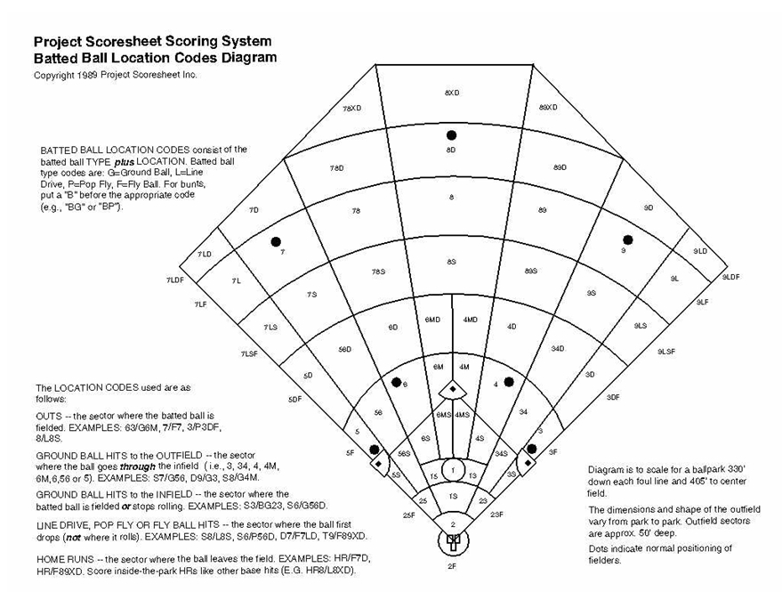
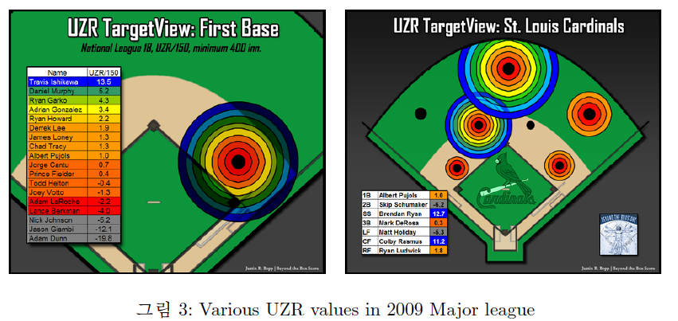
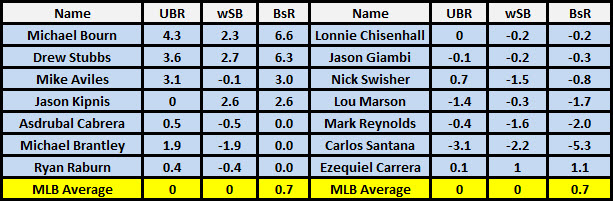

```{r setup, include=FALSE}
knitr::opts_chunk$set(echo = F,cache=T)
library(knitr)
```
이 글은 2013년 12월에 썼던 것을 HTML형식으로 재정리한 내용이며 최신지견이 아님을 감안하길 바란다. 


## 서론
만화 **드래곤볼**을 보면 눈에 착용하는 스카우터라는 안경 비슷한 물건이 있다. 이것을 착용하고 사람을 관찰하면 그 사람의 전투력을 숫자 1개로 표시해 주는데 이는 싸움에서 이기는 능력을 숫자 1개로 단순히 제시해 줌으로서 많은 독자들이 드래곤볼에 빠지게 되는 하나의 원인이 되었다. 


최근 미국 메이저리그에서는 세이버메트릭스(Sabermetrics)라는 분야가 대두되고 선수의 능력을 판단하는 기준으로 활발히 활용되고 있는데, 이는 야구 기록을 수리통계학적으로 분석하여 전통적인 타율, 다승, 방어율 등의 지표를 넘어 어떤 선수가 승리를 부르는 선수인지를 정확히 파악하기 위해 생긴 통계학의 한 분야이다[@albert1997introduction]. 지금은 한국프로야구에서도 널리 쓰이는 OPS(On-base percentage Plus Slugging : 출루율 + 장타율), WHIP(Walks plus Hits divided by Innings Pitched: 이닝(inning) 당 출루 허용율) 가 가장 유명한 세이버메트릭스의 지표이며 메이저리그에서는 이를 넘어 야구는 승리를 위한 게임이고 승리를 위한 것은 곧 득점을 위한 것이라는 가정 하에 모든 포지션의 선수들의 능력치를 득점기여도 또는 승리기여도라는 지표를 만들어 단 하나의 숫자로 표시하려는 노력들이 일어나고 있고 이것의 결정체가 **WAR(Win Above Replacement)**라는 통계량이다. 해석은 해당 포지션의 대체선수(1군의 백업선수 및 마이너리그선수) 대비 몇 승을 더 팀에 가져다 주었는가로 이루어지며 이에 의한 2013년 류현진 선수의 fWAR(fangraph-WAR: WAR의 한 종류, 구하는 방법은 아직 통일되어 있지 않다)는 3.1로 대체 선발투수 대비 3.1승을 더 팀에 가져다 주었다고 해석한다[@WARRyuonline]. 실제로 이 지표들이 자유계약선수(FA: Free Agent) 계약이나 MVP 투표 등에 조금씩 반영되고 있다.


WAR의 핵심은 투수든 타자든 포수든 유격수 등 모든 포지션의 선수의 어떤 행위도 철저하게 득점과 승리를 위한 수단으로 바라보아 승리기여도라는 단 하나의 숫자로 표현해 주는 것으로 이 철학이 서로 다른 시대, 다른 포지션, 다른 구단의 선수들에 대한 비교를 가능하게 해 주는 근거가 된다. 

```{r, echo=FALSE}
a=matrix(c("Scrub","0-1 WAR", "Role player", "1-2 WAR", "Solid starter", "2-3 WAR","Good player","3-4 WAR", "All-Star","4-5 WAR", "Superstar","5-6 WAR","MVP","6+ WAR"),ncol=2,byrow=T)
kable(data.frame(a),col.names=c("Player's value","WAR"),align="cc",caption="Decision of player's value via WAR (fangraph)")
```

<center></center>
<center>Distribution of WAR values in 2010 (fangraph)</center>

한편, WAR가 제시하는 숫자는 직관적으로 이해하기 쉽지만 이를 구하는 방법은 간단하지가 않은데 기본적으로 **WAR는 종합스탯이며 여러가지 통계량의 조합 및 보정**을 거쳐서 만들어지기 때문이다. 이에 본 장에서는 fangraph에서 제공하는 타자와 투수(선발투수 및 불펜투수)의 WAR를 구하는 방법을 간단히 소개하겠다. 

## 타자편
타자의 능력은 크게 **타격, 주루, 수비**의 3가지로 나뉘는데 이 각각의 분야에서 승리기여도를 계산하여 그것을 합한 것이 타자의 WAR에 해당하는 개념이 될 것이다. 

### Batting
가장 기본적인 통계량인 타율(Average)은 안타수/타석수 로 볼넷을 고려하지 못하고 1루타, 2루타, 3루타, 홈런을 모두 같은 가치로 판단하기 때문에 타자의 능력을 정확히 측정하지 못한다. 이를 대체하기 위한 방법으로 출루율+장타율인 OPS, 이를 구장크기 등을 보정해서 평균을 100으로 만든 OPS+등이 있는데, 요즘은 각각의 상황을 모두 고려한 **wOBA(weight On Base Average)**의 개념이 많이 쓰이고 이를 적절하게 변형한 wRAA(weighted Runs Above Average)가 공격력 부분의 WAR 계산에 이용된다. 이제 2012년의 wOBA를 구하는 공식을 살펴보자.

$$\text{wOBA}=\frac{0.691\cdot \text{uBB} + 0.722 \cdot \text{HBP} + 0.884 \cdot \text{1B} + 1.257 \cdot \text{2B} + 1.593 \cdot \text{3B} +
2.058 \cdot \text{HR}} {\text{AB} + \text{BB} – \text{IBB} + \text{SF} + \text{HBP}}$$
(uBB: 고의사구 제외 볼넷, HBP: 사구, AB + BB – IBB + SF + HBP: 타석수)


위 식을 보면 분모는 타석수, 분자는 타석에서 일어날 수 있는 득점기여 상황에 특정 가중치를 곱해서 더한 값이다. 이 가중치는 매년 데이터를 기반으로 회귀분석을 이용해서 구하는데, 각 아웃카운트마다(0 out, 1 out, 2 out) 해당 상황이 일어났을 때 득점 기대값을 추정하여 각 이벤트의 득점가치(Run Value) 값을 구한다(아래 표). 

```{r}
a=read.table("sabermetrics/wOBA.csv",sep="\t",header=T)
kable(a,align="c",caption="Linear weights of 2002-2013 Major league (Fangraph)")
```

이것의 평균을 구한 후 아웃카운트로 인한 득점기대값 손실을 제외한 후 적절한 scale(출루율과 비슷한 의미를 갖게 하기 위한 상수)를 곱해주면 식의 분자에 있는 가중치들이 계산된다(홈런은 홈런을 침으로 인한 기대점수 상승 + 아웃이 되지 않음으로 인한 기대점수 상승 으로 이루어져 있다). 

wOBA는 출루율과 비슷한 의미를 나타내도록 상수를 곱하여 표시한 값으로 2013년 추신수 선수의 출루율은 .423, wOBA는 .393이다(Fangraph, 아래 표). 


```{r}
a=matrix(c("Excellent" ,"0.400","Great","0.370","Above Average", "0.340","Below Average","0.310","Poor","0.300","Awful","0.290"),ncol=2,byrow=T)
kable(data.frame(a),align="c",col.names=c("Rating","wOBA"),caption="Decision of player's value via wOBA (fangraph)")
```

한편 Fangraph의 wOBA는 구장 효과를 고려하지 않은 것이며 이는 작은 구장을 홈구장으로 쓰는 선수의 wOBA가 과대평가 될 수 있음을 의미한다.


이제 이를 기반으로 wRAA를 구해보자. wOBA는 출루율과 비슷한 수치를 갖도록 보정한 결과로 기대득점으로 해석되지 않는다. 따라서 기대득점의 의미를 가질 수 있도록 이를 바꾸어야 하는데 이것이 wRAA이다. wRAA는 weighted Runs Above Average 라는 이름 그대로 평균에 비해 얼마다 더 득점에 기여했는지를 설명하는 수치이며 계산법은 다음과 같다.

$$\text{wRAA} = \frac{\text{wOBA} – \text{league's wOBA}}{\text{wOBA scale}} \times \text{PA}$$
(PA: 타석 수)

즉  wOBA에서 리그 평균의 wOBA를 빼준 후, 출류율과 비슷한 의미를 주기 위해 곱했던 wOBA scale을 다시 나누어 준 후 타석수를 곱하면 그 선수의 타격에서의 평균 대비 기대 득점값이 된다는 것이다. 이를 통한 2013년 추신수 선수의 wRAA는 40.3으로 1시즌동안 약 40.3점의 평균대비 득점 기여를 했다고 해석 할 수 있으며 이는 메이저리그에서 최고수준이다(아래 표). 

```{r}
a=matrix(c("Excellent" ,"40","Great","20","Above Average", "10","Average","0", "Below Average","-5","Poor","-10","Awful","-20"),ncol=2,byrow=T)
kable(data.frame(a),align="c",col.names=c("Rating","wRAA"),caption="Decision of player's value via wRAA (fangraph)")
```

이 WRAA가 타자의 WAR를 계산할 때 공격부분의 지표로 쓰이며 통상 $10\text{점}=1\text{승}$으로 계산하는데 따라서 2013년 추신수 선수는 공격부분에서 평균대비 4.3승 정도를 기여했다고 할 수 있다.


### Fielding
일반적으로 수비지표는 공격지표보다 측정하기 어렵다. 포지션이 제각각인데다가 플라이, 땅볼, 직선타구 등 상황도 여러가지가 있기 때문이다. 수비 지표를 계산하려는 여러 방법들이 제시되고 있는데 본문에서는 Fangraph WAR 계산에 이용되는 수비 지표인 UZR(Ultimate Zone Rating)에 대해 알아보도록 하겠다[@lichtman2003ultimate;@piette2012estimating].


UZR은 야구 데이터 분석 업체 BIS(Baseball Info Solution)이 기록하는 play-by-play data를 기반으로 특정 년도, 특정 리그에서 특정 선수가 그의 포지션에서 그 포지션의 평균보다 얼마나 더 실점을 억제하였는지를 이론적으로 추론하며, 따라서 $+$방향의 UZR은 평균보다 높은 수준의 수비수준을 의미하고 $-$방향의 UZR은 평균보다 낮은 수비수준을 의미한다. UZR은 크게 4부분의 수비능력을 평가하며 다음과 같다.

1. Outfield Arm Runs (ARM) - 외야수의 송구능력(**어깨**)으로 평균보다 몇점을 더 막았는가?


2. Double-Play Runs (DPR) - 내야수가 **병살타**를 잘 유도하여 평균보다 몇점을 더 막았는가?


3. Range Runs  (RngR) - 넓은 **수비범위**로 평균보다 몇점을 더 막았는가?


4. Error Runs (ErrR) - **실책**으로 인해 평균보다 몇점을 더 실점하였는가?


보통 최근 6년간 데이터를 가지고 하면 샘플 숫자가 충분하다고 판단하며, 이 네 부분의 실점억제력을 종합하여 UZR로 표현되는데 이것을 구하는 방법은 매우 복잡하여 본문에서는 대략적인 개요만 살펴보겠으며 보정치가 들어가지 않은 UZR(unadjusted UZR)을 구하는 과정은 다음과 같다[@UZRsaber].

<center></center>
<center>Separated zone for UZR calculation</center>

1. 야구장을 78개의 구역으로 나눈다(이 중 64개 구역만 계산에 이용된다).


2. 이 64개의 zone마다 친공이 각 구역으로 들어올 확률과 아웃될 확률을 계산한다.


3. 플레이어의 out-rate에서 리그평균 out-rate를 뺀다.


4. 여기에 해당 zone으로 공이 온 횟수를 곱한다(Zone rating).


5. 해당선수가 cover한 zone에 대해 이 숫자들을 더한다. 


여기까지가 일반적으로 말하는 **Zone rating** 계산법이고, 여기에 Average Run Value 즉, **각 구역에 떨어진 공이 어느정도의 점수가치를 지니는가**를 고려하는 것이 **UZR**이다. 예를 들면 홈런의 경우 아까의 Run value 표에서 보듯이 2012년의 경우 2.06점의 가치가 있는 것으로 나타나는데, 따라서 홈런을 막는 수비의 경우 +2.06점의 UZR을 받게 되며, 어떤 가상의 존에서 안타의 가치가 +0.5점이라면 이를 아웃으로 잡아내는 행위는 +0.5의 UZR을 받게 되는 것이다. 반대로 이 존에서 안타를 막지 못했을 때는 -0.5점에 해당 수비수가 그것을 막지 못한 행위(예: -0.3점) 을 더하여 -0.8점의 실점을 끼쳤다고 판단하는 것이다. 기타 보정해야 할 사안은 다음과 같다.


1. Park factor(구장효과) - 구장 크기, 구장의 잔디상태(천연 VS 인조) 등.


2. Batted Ball Speed - 타구의 속도.


3. Batter Handedness - 우타자와 좌타자가 자주가는 타구 방향, 각 타구방향시 타구의 속도가 다를 수 있다.


4. Groundball-to-Flyball Ratio - 투수의 투구 성향이 수비수의 수비방법에 영향을 끼친다.


5. Number of Runners On Base - 주자의 수와 위치에 따라 수비위치나 전략이 달라진다.


6. Number of Outs - 아웃카운트에 따라 수비위치나 수비전략이 달라진다. 


이 모든 것을 고려하여 대략 **10점=1승** 의 가치를 가진다는 점을 이용하여 UZR을 승리기여도로 최종적으로 표시한 것이 defensive WAR이며 대략적인 판단기준은 다음과 같다[@UZRfig].

```{r}
a=matrix(c("Gold Glove Caliber" ,"+15","Great","+10","Above Average", "+5","Average","0", "Below Average","-5","Poor","-10","Awful","-15"),ncol=2,byrow=T)
kable(data.frame(a),align="c",col.names=c("Defensive Ability","UZR"),caption="Decision of player's value via UZR (fangraph)")
```

<center></center>
<center>Various UZR values in 2009 Major league</center>

물론 이 수비지표는 매 상황상황을 기록원이 기록하여 데이터를 만든 것으로 주관이 들어갈 여지가 있으며 포수의 수비능력을 측정하지 못한다는 점, 연간 편차가 너무 크다는 점, 다른 포지션의 Zone을 침범하는 것에 대한 고려 등이 문제점으로 제기되고 있으며 이런 것들을 고쳐나가기 위해 지속적으로 연구가 이루어지고 있다. 


### Base running
Base running 즉, 주루플레이는 크게 도루능력과 그 외 상황에서의 진루능력으로 나눌 수 있고 이를 나타내는 지표가 wSB(Weighted Stolen Base Runs) 과 UBR(Ultimate Base Running)이며 이를 합한 후 승리기여도의 지표로 표시한 것이 WAR에 포함되게 된다. 이들을 살펴보자.


wSB는 플레이어가 도루로 기여한 득점기여도에서 리그평균의 그것을 뺌으로서 이루어지는데 수식은 다음과 같다.

$$\text{wSB} = \text{SB} \times \text{runSB} + \text{CS} \times \text{runCS} – \text{lgwSB} \times (\text{1B} + \text{BB} + \text{HBP} – \text{IBB})$$
(SB: 도루 횟수, runSB: 도루의 득점기여도, CS: 도루실패횟수, runCS: 도루실패의 득점기여도, lgwSB: 리그평균 wSB)


회귀분석을 이용하여 runSB와 runCS를 추정하는데 runSB는 보통 0.2로 고정하고 runCS의 경우 매년 수치가 달라지는데, 2012년의 경우 -0.4(Run value 표)이며 이는 성공률이 66.7%가 안되면 도루를 하지 않는 것이 이득이라고 해석할 수 있다. 


다음으로는 도루 외의 주루플레이 능력을 측정하는 UBR에 대하여 알아보자. UBR은 Fangraph에서 자체적으로 개발한 통계량으로 UZR과 마찬가지로 복잡한 계산과 보정이 들어가는 통계량이므로 여기서는 간략한 개요만 설명하기로 하겠다[@UBRsaber]. 앞서 설명한 wOBA, UZR과 마찬가지로 UBR 또한 주루플레이에서 일어날 수 있는 상황에 그 상황의 득점기여도를 곱하는 것으로 이루어지며 일어날 수 있는 주루플레이는 크게 다음과 같다.


1.  안타 상황 시, 한 루를 추가진루했는지, 하지 않았는지, 또는 추가 진루 시도하다가 보살을 당했는지 여부. (진루를 방해하는 다른 앞선 주자가 없었을 경우)


2. 타자가 안타를 쳤을 때 한 베이스를 더 가다가 아웃되는 경우. (세잎되는 경우는 판단에서 제외)


3. 안타 상황 시, 선행주자가 추가진루에 성공했거나 실패 또는 아웃되었을 때, 타자주자가 추가진루에 성공 또는 실패 또는 아웃되는지 여부.


4. 선행주자의 추가진루 또는 보살여부에 따른 후행주자의 추가진루 또는 보살여부.(1번과 합쳐짐)


5. 뜬공으로 인한 아웃시 주자의 추가진루(태그업) 여부.


6. 내야땅볼 상황에서 1루주자가 2루에서 죽었을 때, 타자주자의 세잎 또는 야수선택 여부.


7. 유격수나 3루수 쪽 땅볼이 발생하였을 때 2루주자의 3루진루 및 보살여부. 


8. 내야 땅볼 시 3루주자가 홈에 들어오는 것은 고려하지 않으며, 폭투나 포수실책도 고려하지 않음. 


각각의 상황은 주자의 기회(opportunity)로 간주되며 각각 상황에서의 득점기여도를 추정하여 이를 적용하여 주루플레이의 득점기여도를 계산하게 되며 이를 wSB와 합한 것을 BsR(Base Running)이라 하고 이를 승리기여도의 지표로 바꾼 것이 WAR의 주루플레이 지표이다. 다음은 2013년 클리블랜드 인디언스 일부 선수들의 주루플레이 지표이다[@UBRfig].

<center></center>
<center>wSB, UBR and BsR's of 2013 Indians</center>

### Positional adjustment
수비의 득점기여도를 따질 때 수비포지션에 따라 기여도가 다른 것을 보정하기 위한 것이다[@position_adjust]. 예를 들어 일반적으로 포수가 가장 어려운 포지션이고 지명타자는 수비를 하지 않기 때문에 가치가 떨어질 것인데 이를 고려하는 수치이며 Fangraph에서 이용하는 보정수치는 다음과 같다.

```{r}
a=matrix(c("First Base", "-12.5 runs","Second Base","+2.5 runs","Third Base","+2.5 runs","Shortstop","+7.5 runs", "Left Field", "-7.5 runs","Center Field", "+2.5 runs","Right Field", "-7.5 runs","Designated Hitter", "-17.5 runs"),ncol=2,byrow=T)
kable(data.frame(a),align="c",col.names=c("Position", "Adjustment"),caption="Position adjustment (fangraph)")
```

### Replacement level
지금까지 구한 수치는 모두 리그평균에 비해 어느정도인가를 비교한 통계량인데 실제 그 선수가 어떤 가치를 갖고 있으며 얼마짜리인지 선수를 판단하기에는 적합한 통계량이 아니다[@replace_graham]. 
이를 보완하기 위하여 대체 선수라는 개념이 나왔는데 이는 대략적으로 메이저리그 최저연봉인 40만달러를 받는 선수들에 대한 것으로 이들이 대략적으로 평균보다 얼마나 더 적게 득점에 기여하였는가를 나타내는 것이다. 최저연봉은 메이저리그에 올라오면 누구나 최소로 받는 액수로 다르게 말하면 능력과 상관없는 비용이라 할 수 있으며 공짜로 영입한 선수라고 해석할 수도 있다. 이들이 대략적으로 득점에 얼마나 기여하였는지를 분석해 보니 600타석당 평균보다 -20점정도(타석당 -0.03점) 득점에 기여하는 것으로 나타났으며 이를 Replacement level이라 한다. 즉 타자가 들어선 타석수에 -0.03을 곱하면 Replacement level이 된다는 것이다. 그러나 실제로는 포지션별 가중치가 들어가야 하는 등 계산이 복잡하며 분석하는 방법에 따라 약간의 차이가 있는데, 어쨌든 이를 고려하여 더하면 대체선수대비 득점기여도가 계산되는 것이다[@replace_dave;@replace_dave2].

### Run to win
앞서 대략 10점=1승 으로 계산된다고 했는데 왜 이렇게 계산되는지 알아보자. 이를 위해 알아야 할 개념은 기대승률 개념인 피타고리안 승률(Pythagorean Winning Percentage)이며 이는 다음과 같다.

$$\text{Pythagorean Winning Percentage}=\frac{RS^2}{RS^2+RA^2}$$
($RS$: 팀득점, $RA$: 팀실점)


예를 들어 어떤 팀이 1시즌(162)경기 동안 775점 득점, 775점 실점을 했다고 하자. 그렇다면
피타고리안 승률은 50%가 될 것이고 기대승수는 81점이 될 것이다. 대략적으로 10점정도가 1승을 의미한다고 할 수 있다. 기타 여러가지 경우를 다 살펴보았을 때 대략적으로 10점=1승 이라는 해석을 할 수 있었고 WAR계산에 이것에서 약간 보정한 수치를 이용하고 있다. 


### 2013 추신수
2013년 추신수의 WAR의 세부 지표를 살펴보는 것으로 타자 WAR를 마무리하겠다(아래 표). 

```{r}
a=read.csv("sabermetrics/choo.csv")
kable(a,align="c",caption="WAR of Shin-Soo Choo")
```

2013년을 살펴보면 타격에서 40.9의 대체선수 대비 득점기여도, 주루에서 -0.6점을 기록하여 공격 WAR의 수치는 40.3이고, Fielding 점수 -15.5, 포지션 가중치 2.1(대부분을 중견수로 뛰었음)을 기록하여 수비 WAR는 -13.3을 기록하였다. 여기에 리그보정치(아메리칸리그 VS 내셔널리그) 1점, Replace level 20.3을 더하면 전체 득점기여도(RAR: Run Above Replacement)는 48.4이고 이를 승리기여도로 환산하면 5.2가 된다. 즉 추신수 선수는 2013시즌 대체선수 대비 약 5.2승을 더 팀에 가져다 주었다고 해석할 수 있으며 이는 약 2600만 달러의 연봉가치를 나타내며(대략적으로 1 WAR 가 약 500만 달러의 가치가 있는 것으로 분석되고 있다.), 올시즌 메이저리그 30개 팀의 야수 중 20위에 해당하는 성적이다 (1등은 Mike Trout선수로 10.4 WAR를 기록하였다.) 

## 투수편 : 선발투수
타자의 공격력의 나타내는 지표인 wOBA와 wRAA는 널리 인정되고 있지만 투수의 능력을 나타내는 지표는 간단히 표현하기 어려운데, 이는 실점이 투수에 의해서만 결정되는 것이 아니라 다른 수비수들의 능력과도 관련이 있기 때문이다[@WARpitcher]. 이를 고려하기 위한 많은 방법들이 제안되고 있는데 본문에서는 fangraph에서 이용하는 **FIP(Fielding Independent Pitching)**를 소개하고 이를 이용한 **fWAR(fangraph WAR)**계산에 대해 알아보도록 하곘다[@FIP]. 

### FIP
투수가 허용하는 피안타를 분석한 결과 타자가 맞춘 공은 일정확률로 안타가 될 수 밖에 없다는 것이 최근의 학설이다. 잘 던지는 투수든 그렇지 않은 투수든 일단 타자가 공을 치면 안타가 될 확률은 비슷하게 수렴한다는 것이다. FIP는 이것을 기반으로 타자가 공을 친 후의 상황은 투수가 컨트롤 할 수 없는 부분이라는 것을 전제로 만들어진 통계량인데, 따라서 투수가 전적으로 컨트롤 할 수 있는 부분인 홈런, 삼진, 볼넷, 사구만을 가지고 만들어진 수치이며 다음 해의 성적을 예상하는데 ERA(9이닝 당 평균자책점)보다 예측력이 좋다고 알려져 있고 수식은 다음과 같다[@FIP].

$$\text{FIP}=\frac{(13 \times HR)+(3 \times (BB+HBP))-(2 \times K)}{IP} + constant$$
($HR$: 홈런, $BB$: 볼넷, $HBP$: 사구, $K$: 삼진, $IP$: 투구이닝, $constant$: 보정 상수)


여기서 상수는 보통 3.2를 쓰는데, 리그 평균의 FIP를 리그 평균의 ERA(평균자책점)과 동일하게 해주기 위한 상수이며 매년 데이터를 통해 계산할 수 있다. 홈런에 13이라는 가중치, 볼넷과 사구에 3의 가중치, 삼진의 -2의 가중치가 주어진 것이 특징이며 이 모든 것은 회귀분석을 통해 결정되었는데, 대략적인 FIP의 판단 기준은 아래 표와 같으며 2013년 류현진 선수의 FIP는 3.24였다(평균자책점은 3.00).

```{r}
a=matrix(c("Excellent" ,"2.90","Great","3.25","Above Average", "3.75","Average","4.00", "Below Average","4.20","Poor","4.50","Awful","5.00"),ncol=2,byrow=T)
kable(data.frame(a),align="c",col.names=c("Rating","FIP"),caption="Decision of player's value via FIP (fangraph)")
```

### Replacement level
Replacement level의 팀은 보통 **승률 30%**의 팀으로 간주된다. 이 가정을 인정한다면 30%의 승률을 가지기 위한 선발투수 및 구원투수의 승리능력을 추정해야 하는데, 많은 분석 결과 선발투수가 0.38, 구원투수가 0.47 정도의 승률을 가지고 있으면 팀승률 30%정도의 결과를 얻을 수 있음이 밝혀졌다[@replace_pitch] (일반적으로 구원투수는 적은 이닝을 던지기 때문에 방어율이 낮은 경향이 있다.). 이를 해석하면 소속팀의 본인을 제외한 선수들이 리그평균 수준의 능력을 갖고 있고, 상대편의 선수들도 리그평균 수준의 능력을 갖고 있을 때, Replacement level의 선발투수가 9회를 던지면 38%정도의 승률을 기대할 수 있다는 것이 되고 이는 곧 0.38승을 기여한다는 뜻이 된다. 


### Park adjustment and adjusted RA
우리는 투수의 실점능력을 보려는 것이므로 평균자책점과 비슷하게 맞춘 FIP는 이에 적합하지 않다. 평균자책점에는 실책으로 인한 실점이 빠져있기 때문이다. 평균자책점(ERA)과 평균실점(RA)사이에는 0.92:1의 관계가 성립한다는 것이 경험적으로 알려져 있고 따라서 FIP를 0.92로 나눈 숫자를 투수의 평균실점을 나타내는 지표로 여긴다[@runenv_pitch]. 


투수의 실점능력은 구장의 크기나 상태에 따라서도 차이가 생기게 되는데 구장크기가 작거나, 고지대로 공기저항이 적은 구장은 그만큼 실점하기도 쉬울 것이다. 이를 고려한 것이 Park factor인데 많은 부분을 고려해야 하기 때문에 계산하기가 어렵고 Fangraph의 2013년 Park factor를 보여주는 것으로 정리하겠다.

```{r}
a=read.csv("sabermetrics/Park_factor.csv")
kable(a,align="c",caption="Park factors of 2013 major league's stadium (Fangraph)")
```

이 수치는 최근 구장의 크기나 위치가 크게 변한 곳이 아니라면 최근 5년(2009-2013)의 Park factor를 평균내고 홈구장 절반 원정구장 절반을 경기하는 것을 보정한 수치이다. 홈런 등 각 상황에 대한 Park factor가 따로따로 구해지고 이를 종합하여 득점에 대한 Park factor가 결정된다. Park factor는 100을 기준으로 그보다 크면 타자친화, 미만이면 투수친화를 뜻하고 이것까지 고려하여 조정방어율(Adjusted RA)가 계산된다. 예를 들어 류현진 선수의 2013년 FIP는 3.24이고 다저스 스타디움의 2013 Run Park factor는 95이므로 조정방어율은 $3.24/0.92/0.95=3.71$이 된다. 물론 모든 경우를 고려하여 더 복잡하게 보정할 수도 있다.


### Run environment & Run to win conversion
타자의 경우 대략 10점=1승 으로 계산하였지만 선발투수의 경우는 이를 그대로 적용하기에 문제가 있다. 에이스가 등판하는 경우 더 적은 점수만 득점해도 승리를 얻을 가능성이 높을 것이고 실력이 낮은 투수가 등판하는 경우 더 많은 득점이 필요할 것이기 때문이다. 투수의 능력에 따른 득점-승리의 관계의 변화를 알기 위한 분석방법은 여러가지가 있는데 여기서는 Tom Tango가 제시하고 Fangraph에서 적용하고 있는 공식에 대해 알아보자[@winconversion]

$$\text{Run for 1 win} = (\frac{\text{League RA} + \text{Pitcher’s RA}}{2}+2) \times 1.5$$
(League RA: 리그 평균 9이닝당 실점, Pitcher's RA: 투수의 9이닝당 실점)


이를 토대로 류현진 선수의 1승을 위한 득점수준을 계산해보자. 먼저 Fangraph가 제공하는 2013년의 리그 평균 FIP는 3.87이며 이를 RA scale로 바꾸면 $3.87/0.92=4.21$ 이다. 이제 투수의 9이닝당 실점을 구해야 하는데 선발투수가 9회를 다 던진 것이 아니므로 이를 고려해야 한다. 즉 투수의 평균투구이닝을 제외한 나머지 이닝은 리그평균의 투수가 던진 것으로 가정한다.(리그평균의 구원투수로 넣을 수도 있지만 편의상 리그평균투수가 던진 것으로 대입하자.) 2013 류현진 선수의 9이닝당 평균 실점은 앞서 구한대로 3.71이고 평균 투구이닝은 $192/30=6.4$이닝이므로 결국 류현진 선수의 1승을 위한 득점수준은 아래와 같이 된다. 

$$(\frac{4.21 + (3.71 \times \frac{6.4}{9} + 4.21 \times \frac{2.6}{9})} {2} +2) \times 1.5 = 9.05$$
즉, 류현진 선수의 등판 경기에서 9.05점=1승 의 가치를 가지게 된다고 해석할 수 있다. 


### Win probability
이제 기대 승률만 계산하면 WAR를 계산할 수 있다[@winconversion]. 2013년 류현진 선수의 9이닝당 평균 실점은 3.71, 리그 평균은 4.21이므로 리그 평균에 비해 0.5점 점수를 덜 내주는 것이 된다. 앞서 계산한 1승에 필요한 득점기대값인 9.05를 적용하면 류현진 선수는 리그 평균 투수에 비하여 $0.5/9.05=0.055$ 즉, 9이닝당 0.055승을 리그평균투수보다 더 기여하게 되는 것이다. 리그평균 투수의 승률은 0.5이므로 팀동료와 상대팀이 모두 리그평균수준임을 가정했을 때 $0.5+0.055=0.555$ 의 9이닝당 기대승률을 가지게 된다. 

### 2013 류현진의 WAR
이제 2013년 류현진 선수의 WAR를 계산할 수 있다(투수의 수비능력은 포함되지 않음). Replacement level 선발투수의 기대승률은 앞서 언급한 대로 0.38이었으므로 류현진 선수는 Replacement level의 선발투수에 비해 9이닝 당 0.555-0.38=0.175 승을 더 기대할 수 있다. 류현진 선수의 투구이닝은 192이닝이므로 결국 
WAR$=0.175 \times \frac{192}{9}=3.73$ 이 된다. 즉, 류현진 선수가 Replacement 선발투수에 비하여 3.73승 정도를 팀에 더 가져다 주었다고 해석할 수 있다. 이 수치는 Fangraph WAR인 3.1과 차이가 있는데 Replacement level, 리그평균투수, Park factor의 보정방법의 차이인 듯 하다.


한편 내셔널리그는 투수도 타격을 하는 관계로 타석에서의 WAR도 고려해야 하는데 Fangraph에 의하면 Batting -4.1, Base running -1.2, Positional adjustment 6.2 로 공격 WAR -5.3, 수비 WAR 6.2 이고 리그보정 0.1, replacement level 1.9를 적용하여 합하면 RAR=$2.9$, WAR=$0.3$ 이 된다. 따라서 타격성적까지 종합한 류현진 선수의 WAR=$3.1+0.3=3.4$ 가된다. 즉 류현진 선수가 투구와 타격으로 대체선수보다 **팀에 3.4승 정도를 더 주었다**고 해석한다 (2013년 Clayton Kershaw의 투구 WAR=6.5 이다.).


## 투수편 : 구원투수
구원투수의 WAR에 대해서는 선발투수와 다른 점을 위주로 간략히 설명하겠다. 대부분의 계산은 선발투수와 동일하나, 구원투수에서는 어떤 중요한 점을 고려해야 하는데 그것이 바로 등판 상황의 경기 중요도이다. 예를 들어 9회말 1점차로 리드하고 있는 순간에서의 등판과, 패전처리에서의 등판이 승리기여정도가 다를 것임은 명확하다. 선발투수의 경우 위기순간을 만드는 것도 본인의 능력이기 때문에 이를 고려할 필요가 없지만 구원투수의 경우는 어떤 중요한 순간에 등판하는 것이냐에 따라 승리기여도가 다를 것임을 생각해야 한다. 

### LI (Leverage Index)
LI는 등판 상황의 중요도를 평가하기 위한 지표로 등판상황 시 여러가지 경우의 수에 따른 기대 승률의 변화(WPA: Win Probability Added)의 평균값을 한타석의 평균 WPA로 나눈 값이다[@Li_tango]. 참고문헌의 예제 중 하나를 살펴보자. 9회초(홈팀 수비, 원정팀 공격) 홈팀이 원정팀에 3점 이기고 있는 상황에서 무사 1,2루에 구원투수가 등판하였다고 가정하자. 메이저리그에서 통계학적으로 위 상황에서 홈팀이 결국 승리할 확률은 0.841인데 예를 간단히 하기 위해 타자의 경우의 수는 안타 또는 주자가 진루하지 않는 아웃(삼진 또는 내야플라이 등)만 있다고 가정하자. 만약 안타를 치면 2점차로 점수차가 좁혀지고 무사 1,3루 상황이 되며 이때의 기대승률은 0.701로 알려져 있으며, 아웃되면 3점차가 그대로 유지되고 1사 1,2루 상황이 되고 기대승률은 0.91로 증가하게 된다. 계산을 간단히 하기 위해 타자는 $\frac{1}{3}$의 확률로 안타를 치고, $\frac{2}{3}$의 확률로 아웃이 된다고 가정하면 기대승률의 변화값의 가중평균을 구할 수 있다. 

$$|0.841-0.701| \times \frac{1}{3} + |0.841-0.91| \times \frac{2}{3}=0.093
$$

이것이 해당 타석에서 기대승률이 변할 수 있는 정도라고 할 수 있을 것이다. 이 수치가 얼마나 중요한지 알기 위하여 한 타석의 평균적인 기대승률의 변화 정도를 계산해야 하는데, 1999-2002년의 4년간의 데이터를 토대로 구한 한 타석의 평균적인 기대승률의 변화 정도는 0.0346으로 추정되었다. 따라서 해당 타석의 상대적인 중요도는 $0.093/0.0346=2.69$로 평균보다 2.69배 중요한 상황이라고 해석할 수 있고 이 때 2.69를 구원투수 등판상황의 LI라 정의한다. 이론적으로 평균 LI는 1이 될 것이고 이보다 크면 평균보다 중요한 상황, 1보다 작으면 평균보다 중요치 않은 상황이 될 것이다. Tango는 모든 상황에 대한 LI를 구하여 제시하였는데 이는 [여기](http://www.insidethebook.com/li.shtml#18) 에서 확인할 수 있다.


### WAR calculation
그럼 단순히 선발투수 구하는 것처럼 구한 WAR에 LI를 곱하면 구원투수의 WAR가 되는 것 아닐까? 라고 생각할 수 있지만 그리 간단하지가 않다. 일단 구원투수가 아웃카운트를 잡거나 안타, 홈런 등을 허용함에 따라 시시각각으로 LI가 변화하게 되며 그 때 마다 replacement level도 달라지게 된다. 매 순간의 상황을 모두 고려하여 WAR에 반영하는 것은 너무 복잡하기 때문에 데이터를 분석하여 이를 고려한 공식을 개발하였는데 Tango와 Fangraph가 보정하고 있는 조정 LI는 아래와 같다[@effLI].


$$\text{Effective LI} = \frac{1+\text{gmLI}}{2}$$
(gmLI : 구원투수의 등판 순간의 LI)


이를 이용하여 2013년 Uehara Koji(이하 Uehara) 투수의 WAR를 간접적으로 계산해 보자 (실제 보정되는 부분은 본 계산보다 더 복잡하다.).


Fangraph에 의하면 Uehara의 투구이닝은 $74\frac{1}{3}$이고 FIP는 1.61, 리그 평균 구원투수의 FIP는 3.70이고, 보스턴 레드삭스의 Park factor(위의 표 참조)인 104를 고려하면 Uehara와 리그 평균 구원투수의 9이닝당 평균 실점(RA)은 각각 1.68, 4.02가 된다. 편의상 10점=1승의 공식을 따른다고 하고, 앞서 언급한 replacement level 구원투수의 기대승률 0.47을 적용하면 replacement level의 투수는 평균적인 구원투수보다 9이닝당 $(0.5-0.47) \times 10 = 0.3$점을 더 내주게 되고 따라서 replacement level의 9이닝당 평균 실점은 $4.02+0.3 = 4.32$가 된다. 따라서 Uehara는 replace level에 비하여 9이닝당 $4.32 - 1.68 = 2.64$ 점 덜 실점하게 되며 Uehara의 이닝을 고려하면 $2.64 \times \frac{74.333}{9} = 21.8$ 점 덜 실점하게 되고 RAR(득점기여도)는 21.8가 된다. 여기에 Fangraph가 제공하는 Uehara의 평균 gmLI 1.55를 적용하면 Effective LI$=\frac{1+1.55}{2} = 1.275$가 되고 실질적인 득점기여도는 $21.8 \times 1.275 = 27.8$ 로 나오게 된다. 따라서 10점을 1승으로 계산한다면 2013년 Uehara의 WAR는 2.78이 되며, 류현진 선수에게 적용했던 $9.05\text{점}=1\text{승}$ 의 개념을 적용하면 3.07이 되는데, 실제 Uehara의 2013년 fWAR(fangraph WAR)는 3.3으로 이는 구원투수 중 최고 수준이며 류현진보다도 높다. 실제와의 차이는 실제 우에하라가 마무리투수로만 등장하지 않아 LI보정이 복잡하게 이루어졌기 때문일 것이라 생각된다. 


## 마무리: 요약
위에서 설명한 WAR 개념의 특성과 계산에서의 주요 특성을 요약하면 다음과 같다.


### WAR 개념의 특징

1. 선수의 모든 행위를 승리(득점기여도)기여도로 판단하는 극단적인 결과지상주의를 반영한다.


2. 승리기여도라는 단 하나의 숫자로 표현함으로서 직관적으로 받아들이기 쉬우며, 이것이 장점이 되어 선발투수, 구원투수, 타자(내야수, 외야수, 지명타자 등), 심지어 감독까지 서로 다른 역할을 하는 사람들을 비교할 수 있다.


3. 평균대비가 아닌 대체선수대비(메이저 최저연봉 40만달러의 몸값을 지닌 가상의 선수) 몇 승을 가져다 주느냐를 추정하여, 2와 더불어 선수의 성적을 넘어 몸값을 추정하는 근거로 이용된다. 

### WAR 계산의 특징

1. 타자가 생산하는 볼넷, 안타, 2루타-홈런, 삼진, 도루, 도루실패 등등을 모두 각각이 
생산되었을 때의 평균적인 기대득점을 적용하여 타자의 행위를 종합적으로 득점기여도로 판단한다. 


2. 수비능력의 판단에서 경기장을 70여 개의 수비가능구역으로 나누고 각각의 수비구역에서 수비 성공 (아웃, 병살 등), 실책이 평균적으로 어느정도의 실점기여를 하느냐를 추정한다. 즉 수비 성공 + 성공이 가져다 주는 득점기여를 계산한다. 


3. 주루플레이 능력 판단에서  도루성공, 실패, 한베이스 더 진루, 태그아웃 등에 대한 모든 기대득점을 고려한다.


4. 투수의 능력을 평가할 때, 인바운드 된 타구가 안타가 될 확률는 누구나 비슷하다는 철학 하에 평균자책점(ERA) 대신 전적으로 투수의 능력이라고 할 수 있는 홈런과 볼넷 그리고 삼진만을 고려한 FIP라는 지표를 이용한다. 


5. 1회초 0아웃부터 9회말 2아웃까지 모든 득실차 상황에 대한 기대 승률을 계산하여 이를 기반으로 등판 중요도(Leverage Index) 를 추정하여 패전처리투수와 긴박한 상황에 나오는 투수의 승리기여도를 다르게 판단할 수 있는 근거가 된다.


6. 구장의 특성(타자친화 VS 투수친화) 을 스탯에 반영한다. 


지금까지 최근 메이저리그에서 고과평가 및 선수평가에 적용되는 WAR의 개념과 대략적인 계산법을 알아보았다. 메이저리그에서 이런 개념이 개발되고 과감하게 적용하고 있는 것은 전적으로 방대한 데이터와 거대자본의 힘이라 할 수 있을 것이다. 한국에서도 점점 WAR를 중요한 지표로 보고 있는데 앞으로의 야구가 기대된다. 

## 참고문헌

